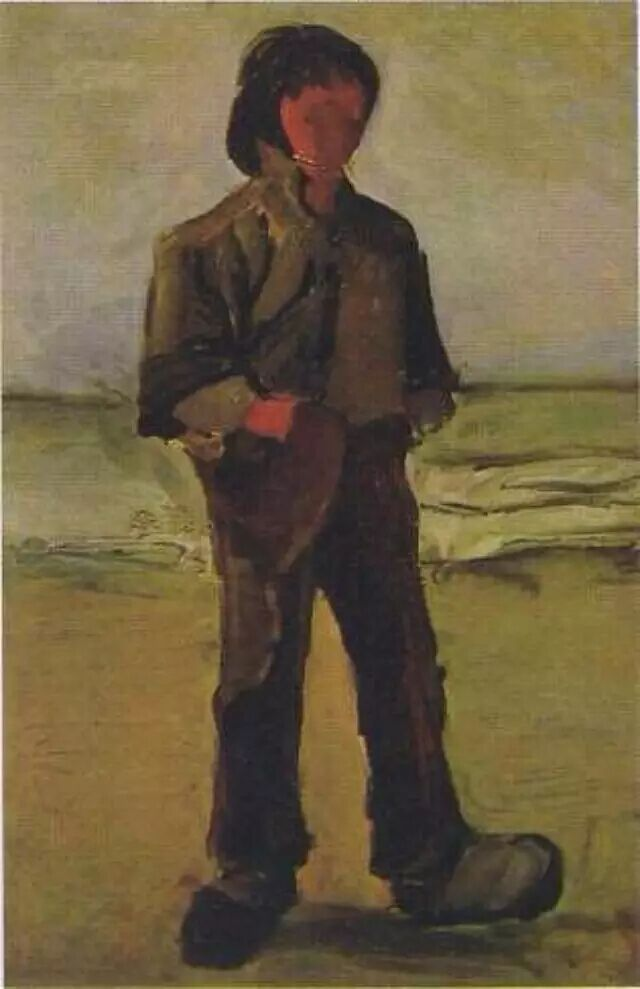

### 重启
最近偏好看访谈，找来许知远的《十三邀》跟陈丹青的《局部》来看，配合着项飚的《把自己作为方法》。访谈作为一种谈话形式，我尤为关注许知远在其中的提问，如何开启话题、如何切入，提问的问题反应出了许知远如何认知“人”这个概念，从那些方面来提问也反映着背后的评价标准。比如他对李诞的一期中从李诞的成长经历开始，了解这些成长经历对如今的影响，以当今的视角对当时人事的认知等等，能够感受到许知远在挖掘人的丰富性，我们有何不同，而我们又因何不同。

陈丹青的《局部》是讲绘画的，绘画背后的人，截取绘画中的点来展开。之前看过美术史的课，但是没找到之前的历史记录。这里有个令我惊讶的 WebSite 是 [Google Arts ：Google 艺术与文化](https://artsandculture.google.com/)，能够在其中找到很多艺术家的作品以及其介绍。国内也有介绍这个作品的一个网站，但是我也找不到了。

访谈跟美术史都跟我的职业多少有点关联，我喜欢这两位更重要的点是在《十三邀》中我看到了更加丰富的人，在《局部》中能感受到艺术的鲜活跟多样性。

项飚在《把自己作为方法》这本书中谈到现代年轻人对周边生活感知的弱化，假如让你介绍你周围的社会环境，你能够描述清楚它们是如何运作的吗？有哪些细节？这种内在化的了解能帮助我们认识这个环境未来的模糊走向，在我看来是属于某种背景信息再结合自身判断做出来的预测。而理想与现实的距离是否就在于这种预测与实际的偏差范围呢？

人的丰富性作为我如今认知的一个方向，人事的热忱、多样化的思维更令人感动。在这些面前，对错变成了尺度的问题，而非绝对。   

### 未完成
陈丹青在《局部》的前十期左右讲到几个很有意思的词，分别是：定件（任务）、未完成、英雄/英雌。

定件：是指在绘画早期教堂等一些大人物找画家、雕塑家在某些指定位置绘画或者雕刻。这个词我第一次听到，很是新奇，准确传达了这件事。

英雄/英雌：我一直听到的描述是英雄，英雌这个说法也是第一次听，很是新奇。这个词是某一集中形容 [关紫兰](https://en.wikipedia.org/wiki/Guan_Zilan) 还是另一个画家的，有点记不清了。   

以梵高的《海边渔夫》这幅画为引子来讨论 **未完成** 这个概念，这里提出一个问题：“画家如何判断自己的画画完了呢？” 

陈丹青对比了不同时代文艺复兴早期跟印象派的作品，早期的作品很是精致，完成度也很高。而印象派的作品在当时给人们的是一种“没画完”的感受。我对美术史不是很懂，在这里面我关注一个概念在不同时期的不同认知，**未完成** 这个概念在不同时期的不同认知。

在早期的定件时，画家的作品是否完成是由双方共同判定的，到后来随着艺术来到贵族跟下层人民的时期，画家具有了更多的自由，这时候的 **未完成** 的概念是由画家说了算的。   